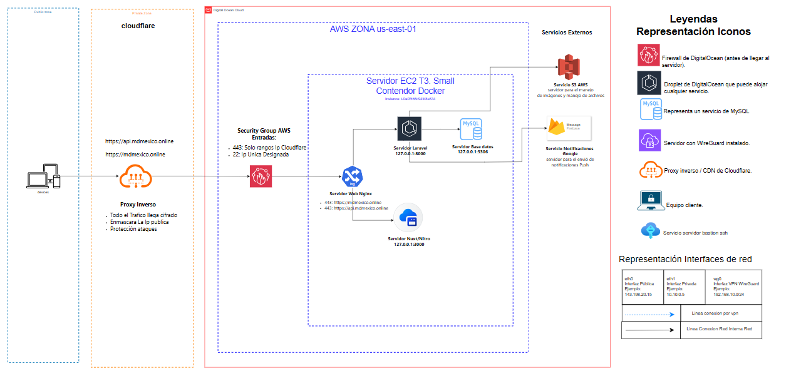

import { FileTree } from '@astrojs/starlight/components';

Producción es **un solo servidor** (AWS EC2 t3.small, Ubuntu 24.04) con todo en **Docker**,
detrás de **Cloudflare**. El servidor no compila nada: **GitHub Actions** construye las imágenes,
las publica en **GHCR** y el servidor solo las descarga y las ejecuta.

## Arquitectura

Esta imagen es solo para fines ilustrativos y no representa la arquitectura real de producción.



## Cómo llega un cambio a producción

```text
PC          git push origin main
              │
GitHub        ▼  Actions: "Build and publish images" (2–5 min)
              │  construye md-api y md-web → GHCR, etiquetadas con el SHA y "latest"
              │
Servidor      ▼  git pull → docker compose pull → migrate → docker compose up -d → verificar
```

- **Imágenes inmutables por commit.** Cada build publica `md-api:<sha>` y `md-web:<sha>`. Volver a
  una versión anterior es fijar su SHA ([Rollback](/deploy/operacion/rollback/)).
- **La configuración viaja por git y los secretos no.** El servidor tiene un clon del repo
  (solo lectura) del que toma el `docker-compose.yml` y las configuraciones de nginx y MySQL. El
  `.env`, los certificados y las credenciales viven solo en el servidor.
- **Hoy el despliegue en el servidor es manual.** El job de GitHub Actions que lo automatiza está
  pendiente ([Estado y pendientes](/deploy/pendientes/)).

## Dónde vive cada cosa

### En el repo

<FileTree>
- .github/workflows/build-images.yml construye y publica las imágenes
- docker/
  - php/Dockerfile imagen de la API (target `prod`)
  - php/docker-entrypoint.prod.sh `config:cache`, `route:cache`, `storage:link`
  - node/Dockerfile imagen del frontend (target `prod`)
- deploy/
  - docker-compose.yml **todo el stack de producción** en un archivo
  - .env.example plantilla del `.env` del servidor
  - nginx/conf.d/ vhosts, rangos de Cloudflare, healthcheck
  - mysql/prod.cnf configuración de MySQL para 2 GB de RAM
- laravel-api-kit/config/scheduled_tasks.php tareas programadas permitidas
</FileTree>

### En el servidor

<FileTree>
- /opt/md/ clon del repo (dueño `ubuntu`, se actualiza con `git pull`)
  - deploy/
    - docker-compose.yml
    - .env **secretos**, permisos 600, fuera de git
    - certs/ certificado Origin CA de Cloudflare, fuera de git
    - secrets/ cuenta de servicio de Firebase, fuera de git
</FileTree>

| Datos que sobreviven a los deploys | Dónde |
|---|---|
| Base de datos | Volumen Docker `md_mysql_data` |
| Disco `public` de Laravel | Volumen Docker `md_api_storage` |
| Archivos de usuario (fotos, documentos) | Bucket de AWS S3 |
| Respaldos de la base | Bucket de AWS S3, carpeta `backups/` ([Respaldos](/deploy/operacion/respaldos/)) |

## Decisiones de diseño

| Decisión | Por qué |
|---|---|
| Un servidor, Docker Compose | Un solo desarrollador: Kubernetes, Swarm o blue/green serían complejidad sin beneficio |
| Build en CI, no en el servidor | Compilar Nuxt en 2 GB de RAM es lento y arriesga quedarse sin memoria. El servidor no necesita código fuente ni herramientas de build |
| Imágenes por SHA en GHCR | Rollback en segundos cambiando una etiqueta |
| Cloudflare + Origin CA | Sin renovación de certificados (válido hasta 2041); el origen solo acepta tráfico que viene de Cloudflare |
| Sin Redis | Sesiones, caché y colas en MySQL: suficiente para la carga actual y una pieza menos que operar |
| Scheduler propio | Las tareas periódicas (vacaciones, respaldos, limpieza) las corre la app, sin depender de servicios externos |

## Riesgos aceptados

- **RAM justa.** Con todo arriba se usan unos 900 MiB de 1.9 GiB, con 2 GB de swap como colchón.
  Si `free -h` muestra swap en uso sostenido, el siguiente paso es una t3.medium.
- **Unos segundos de 502** en cada despliegue, mientras se recrea `api`.
- **Cloudflare corta las peticiones a los 100 s.** Una exportación más lenta devuelve 524 aunque
  PHP siga trabajando.
- **Un servidor es un punto único de falla.** Los respaldos van fuera del servidor (S3) y el stack
  se puede montar en otro servidor con [Montar el servidor desde cero](/deploy/instalacion/).
